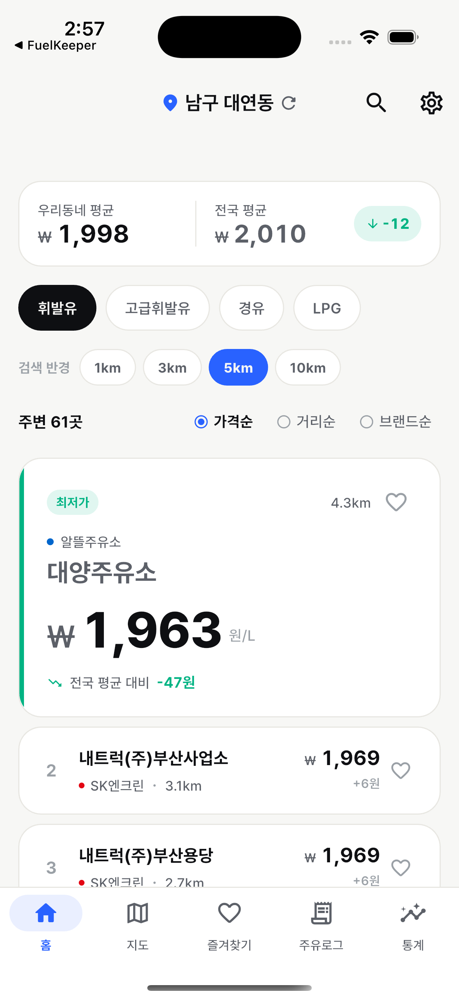
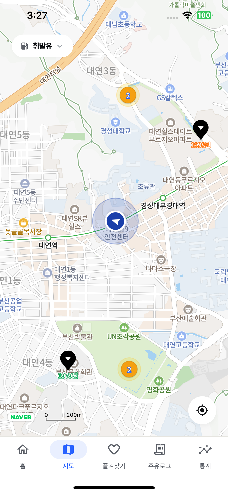
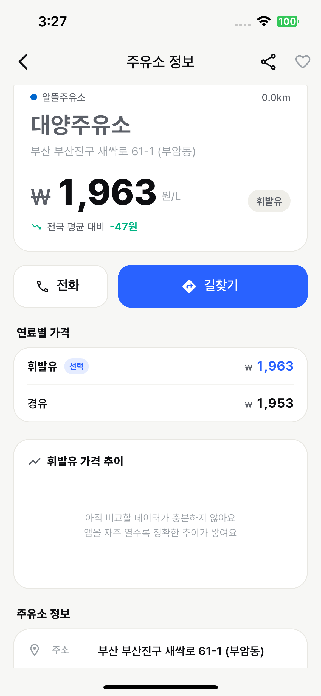
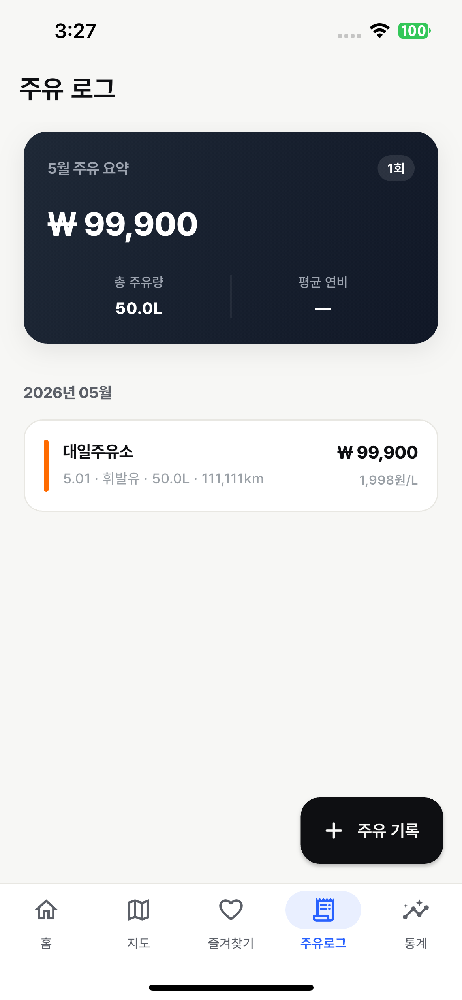
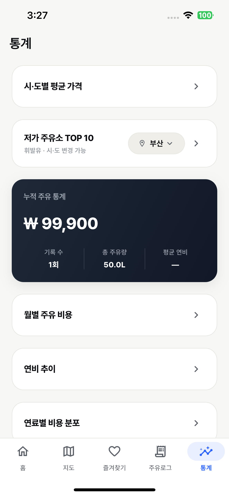
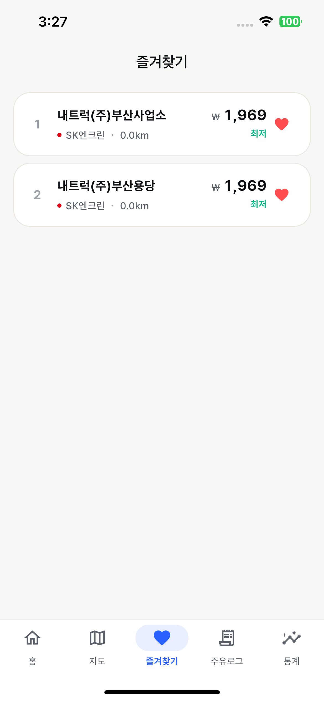
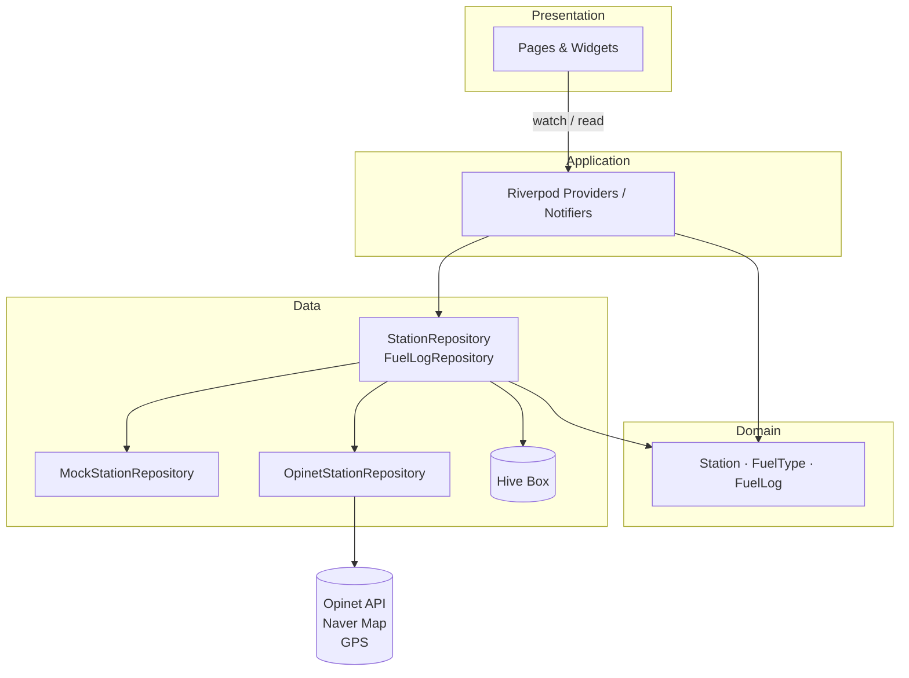

# ⛽ FuelKeeper

> **실시간 주유소 가격 비교 + 개인 주유 가계부** 앱
> Flutter · Riverpod · Naver Map · Opinet API · Hive

내 주변 주유소를 가격순으로 비교하고, 매번의 주유 기록을 남겨 월별 통계로 한눈에 확인하는 1인 운전자용 앱입니다.

---

## 📸 데모

| 홈 (가격순 리스트) | 지도 (브랜드별 마커) | 주유소 상세 |
| :---: | :---: | :---: |
|  |  |  |

| 주유 로그 | 통계 | 즐겨찾기 |
| :---: | :---: | :---: |
|  |  |  |

> 스크린샷은 `docs/screenshots/` 폴더에 추가 예정

---

## ✨ 주요 기능

### 1. 내 주변 주유소
- **GPS 기반 자동 위치 인식** — 역지오코딩으로 "강남구 역삼동" 같은 동 이름 자동 표시
- **5km 반경의 주유소를 4종 연료별**(휘발유 / 고급휘발유 / 경유 / LPG)로 가격 비교
- **3가지 정렬**: 가격 / 거리 / 브랜드
- **우리동네 평균 vs 전국 평균** 비교 배너

### 2. 지도 뷰
- Naver Map에 가격 캡션이 붙은 주유소 마커
- 마커 색상 = 브랜드 컬러 (SK · GS · 현대오일뱅크 · S-OIL · 알뜰주유소 등)
- 마커 탭 → 하단 카드에 정보 표시 → 상세 화면 진입

### 3. 주유소 상세
- 가격 / 7일 가격 추이 차트 (CustomPainter)
- 브랜드 / 주소 / 전화 / 영업시간
- 편의시설(세차 · 정비 · 편의점) 표시
- 즐겨찾기 토글

### 4. 주유 로그 (Hive 로컬 DB)
- 주유소 · 연료 종류 · 단가 · 리터 · 주행거리 입력
- **자동 계산**: 단가 × 리터 = 총액, 주행거리 변화로 연비 계산
- 월별 그룹핑 + 스와이프 삭제

### 5. 통계
- 월별 지출 막대 차트
- 연비 추이 라인 차트
- 연료 종류별 도넛 차트
- 자주 가는 주유소 TOP 5

---

## 🛠 기술 스택

| 영역 | 사용 기술 |
| --- | --- |
| **Framework** | Flutter 3.x · Dart 3.x |
| **상태관리** | Riverpod 3.x (`Notifier` · `FutureProvider` · `StreamProvider`) |
| **라우팅** | go_router 17.x (`StatefulShellRoute.indexedStack` 기반 5-탭 셸) |
| **로컬 저장소** | Hive (수동 `TypeAdapter`) · SharedPreferences |
| **HTTP** | Dio |
| **위치/지도** | geolocator · geocoding · flutter_naver_map |
| **좌표 변환** | proj4dart (WGS84 ↔ KATEC) |
| **차트** | CustomPainter 직접 구현 (외부 라이브러리 ❌) |
| **외부 API** | [한국석유공사 Opinet 유가정보 API](https://www.opinet.co.kr/api/avgAllPrice.do) · [네이버 클라우드 플랫폼 Maps SDK](https://www.ncloud.com/product/applicationService/maps) |

---

## 🏗 아키텍처

**Clean Architecture (단순화)** — Presentation / Application / Domain / Data 4계층



### 핵심 설계 결정

- **Repository 추상화** — `StationRepository` 인터페이스 뒤에 `Mock` / `Opinet` 두 구현체. `--dart-define=USE_MOCK=true`로 즉시 전환 가능 (오프라인 시연/디자인 검수에 유용)
- **30분 인메모리 캐시** — 같은 위치 + 같은 연료 조합은 30분 동안 API 재호출 없음
- **차트 직접 구현** — 외부 차트 라이브러리 의존성 0개. CustomPainter로 막대 / 라인 / 도넛 / 스파크라인 모두 구현 (앱 용량 ⬇, 디자인 자유도 ⬆)
- **좌표계 변환 자체 처리** — Opinet은 KATEC, GPS/지도는 WGS84. proj4dart로 양방향 변환 모듈화
- **에러 자가복구** — Hive Box 손상 시 자동 삭제 후 재생성, 위치가 한국 영역 밖이면 강남 fallback

---

## 📁 폴더 구조

```
lib/
├── app/                       # 앱 전역 (테마 · 라우터 · 환경설정)
│   ├── config/                # API 키 (gitignored)
│   ├── router/                # go_router 정의
│   └── theme/                 # 색상 · 타이포 · 간격 · 라운딩
├── core/                      # 기능 횡단 유틸
│   ├── location/              # GPS + 역지오코딩 Provider
│   ├── network/               # Opinet API 클라이언트 (Dio)
│   └── utils/                 # 좌표 변환 (KATEC ↔ WGS84)
└── features/                  # 화면 단위 모듈
    ├── home/                  # 주유소 리스트
    ├── map/                   # 네이버 지도
    ├── station_detail/        # 주유소 상세
    ├── logs/                  # 주유 가계부 (Hive)
    ├── stats/                 # 통계 (CustomPainter 차트)
    ├── favorites/             # 즐겨찾기
    ├── notifications/         # 알림
    ├── onboarding/            # 첫 실행 플로우
    ├── splash/                # 스플래시
    └── shell/                 # 5-탭 BottomNavigation
```

각 feature는 `presentation` / `application` / `data` / `domain` 으로 내부 분리.

---

## 🚀 시작하기

### 사전 준비

1. **Flutter SDK 3.x** 설치
2. **Android Studio** + 에뮬레이터 (또는 안드로이드 실기기)
3. **API 키 발급**
   - **네이버 클라우드 플랫폼**(NCP) Maps Client ID — [발급 가이드](https://api.ncloud-docs.com/docs/ai-naver-mapsmobilesdk)
   - **한국석유공사 Opinet** 무료 API 키 — [신청](https://www.opinet.co.kr/api/sample.do)

### 환경 설정

`.gitignore`로 보호된 두 개의 설정 파일을 만들어주세요.

```dart
// lib/app/config/naver_map_config.dart
class NaverMapConfig {
  static const String clientId = 'YOUR_NCP_CLIENT_ID';
}
```

```dart
// lib/app/config/opinet_config.dart
class OpinetConfig {
  static const String apiKey = 'YOUR_OPINET_API_KEY';
}
```

> 각각 `.example.dart` 파일이 함께 제공되니 복사 후 키만 교체하시면 됩니다.

### 실행

```bash
# 의존성 설치
flutter pub get

# 실제 API로 실행 (기본)
flutter run

# Mock 데이터로 실행 (오프라인 / 디자인 검수)
flutter run --dart-define=USE_MOCK=true
```

---

## 💡 주요 기술적 결정

### Naver Map vs Google Maps
국내 도로 / 주유소 데이터 정확도와 한국어 지명 표시 품질에서 Naver Map이 우위. 또한 Naver Map은 Client ID가 패키지명 화이트리스트로 보호되어 노출 시에도 비교적 안전.

### Hive vs SQLite
주유 로그는 단일 객체 구조라 관계형 DB가 불필요. Hive는 코드 한 줄로 CRUD 가능하고 Mobile에서 SQLite보다 빠름. `TypeAdapter`만 직접 작성 (`build_runner` 의존성 ❌).

### Riverpod 3.x `Notifier`
`StateProvider`가 deprecated되어 `Notifier` + `NotifierProvider` 패턴으로 작성. `FutureProvider` / `StreamProvider`로 비동기 작업의 로딩 / 에러 / 데이터 상태를 자동 관리.

### CustomPainter 차트
`fl_chart` 같은 라이브러리는 디자인 시스템과 정확히 맞추기 어렵고 빌드 사이즈를 키움. CustomPainter 직접 구현으로 디자인 100% 컨트롤 + 의존성 최소화.

---

## 🚧 프로덕션 출시 시 추가 작업

이 프로젝트는 **포트폴리오 목적**으로 빌드되었습니다. 실제 App Store / Play Store 출시를 가정하면 아래 작업이 추가로 필요합니다.

| 영역 | 추가 작업 |
| --- | --- |
| **API 키 보호** | Opinet `certkey`가 클라이언트에 내장되어 있어 디컴파일로 노출 가능. 자체 백엔드 프록시 서버를 두고 키 보관 |
| **지역 검색** | 현재는 GPS 위치 기반만 지원. 전국 행정동 dataset(약 5천 개) 번들링 + 자동완성 검색 UI 필요 |
| **캐시 영속성** | 인메모리 캐시 → Hive 영구 저장 + ETag 기반 갱신, 오프라인 모드 지원 |
| **에러 모니터링** | Crashlytics 연동, 사용자 행동 분석(Firebase Analytics) |
| **운영** | Remote Config로 긴급 기능 토글, In-App Review 플로우 |
| **법적** | 개인정보처리방침 페이지, 위치 권한 사유 문구, Opinet 출처 표기 |
| **iOS 빌드** | Mac + Xcode 환경에서 `Info.plist`(권한, Naver Map Client ID, ATS) 설정 + 서명 |

---

## 📝 라이선스

이 프로젝트의 코드는 학습 / 포트폴리오 목적으로 자유롭게 참고하실 수 있습니다.
주유가격 데이터 출처: **한국석유공사 오피넷 (Opinet)**

---

## 👤 만든 사람

**secgyu**
- GitHub [@secgyu](https://github.com/secgyu)
- Repo [github.com/secgyu/fuelkeeper](https://github.com/secgyu/fuelkeeper)
