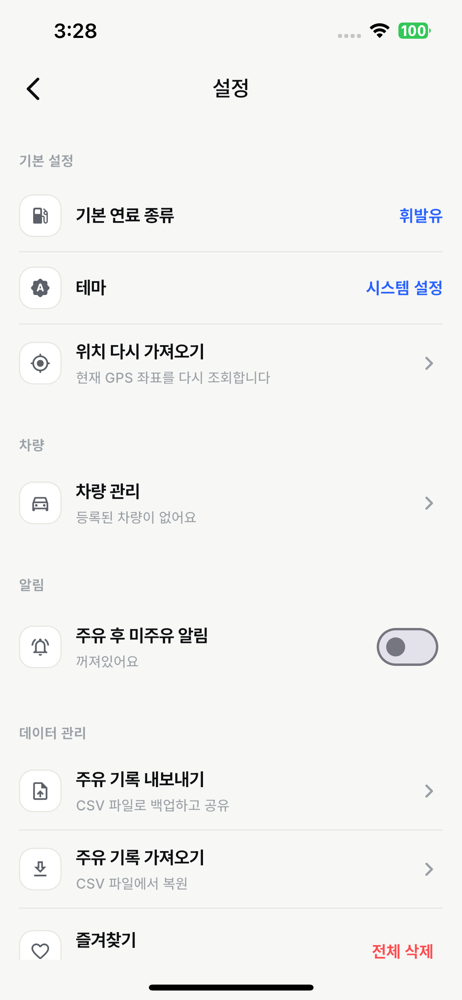
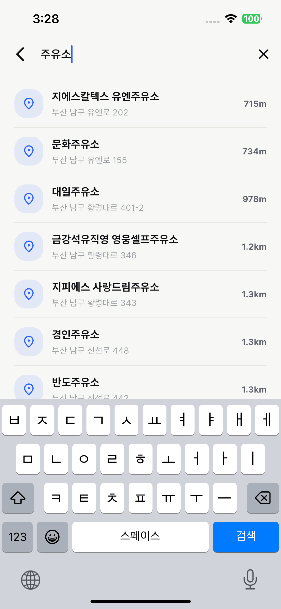
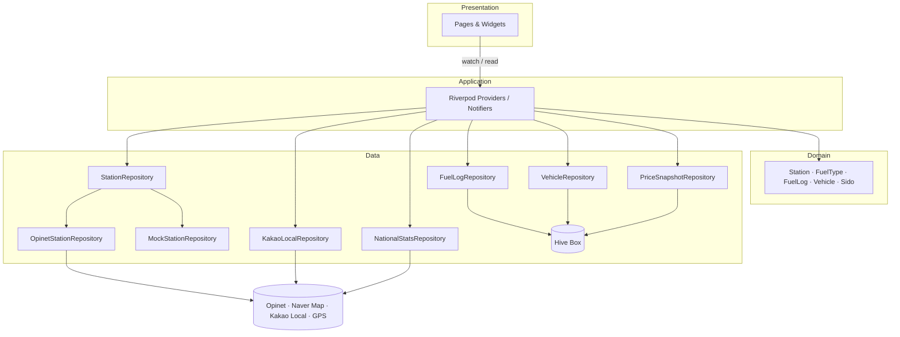

# ⛽ FuelKeeper

> **실시간 주유소 가격 비교 + 개인 주유 가계부 + 전국 가격 통계** 1인 운전자용 모바일 앱
> Flutter 3.x · Riverpod 3.x · Naver Map · Opinet · Kakao Local · Hive

내 주변 주유소를 가격순으로 비교하고, 매번의 주유 기록을 차량별로 관리하며, 시·도별 평균과 전국 저가 TOP 10까지 한 화면에서 확인하는 앱입니다.

> 한국어 단일 언어 / Android · iOS 양 플랫폼 지원

---

## 📥 다운로드 (Android)

|     플랫폼      |                           파일                            |  사이즈   |                비고                 |
| :-------------: | :-------------------------------------------------------: | :-------: | :---------------------------------: |
| Android (arm64) | [Releases](https://github.com/secgyu/fuelkeeper/releases) | **52 MB** | 2017년 이후 출시된 기기 대부분 호환 |

> 빌드 최적화로 universal APK 139MB → arm64-only **54MB(-61%)** 까지 감량. 자세한 내용은 [빌드 최적화](#-빌드-최적화-아래는-실측-결과) 섹션 참고.

---

## 📸 데모

|         홈 (가격순 리스트)         |       지도 (브랜드별 마커)       |              주유소 상세               |
| :--------------------------------: | :------------------------------: | :------------------------------------: |
|  |  |  |

|             주유 로그              |        통계 (전국 + 내 통계)         |                   즐겨찾기                   |
| :--------------------------------: | :----------------------------------: | :------------------------------------------: |
|  |  |  |

|                 차량 관리                  |               장소 검색                |
| :----------------------------------------: | :------------------------------------: |
|  |  |

---

## ✨ 주요 기능

### 1. 내 주변 주유소

- **GPS 자동 위치 인식 + Kakao Local API 역지오코딩** — "부산 남구 대연동" 같은 한국식 표기 정확 추출
- **반경 선택 가능**: 1 / 3 / 5 / 10 km — `SharedPreferences`로 영속화
- **4종 연료별** 가격 비교 (휘발유 · 고급휘발유 · 경유 · LPG)
- **3가지 정렬**: 가격 / 거리 / 브랜드
- **우리동네 평균 vs 전국 평균** 비교 배너
- **장소 검색**: Kakao 키워드 검색으로 임의 위치를 임시 기준점으로 설정

### 2. 지도 뷰

- Naver Map 기반, 가격 캡션이 붙은 주유소 마커
- **브랜드 컬러 마커** (SK · GS · 현대오일뱅크 · S-OIL · 알뜰주유소 · 기타)
- **줌 레벨에 따른 클러스터링** — 도심 밀집 지역에서도 깔끔
- **회전하는 화살표 모양 현재 위치 마커** — `flutter_compass` 기반, 카카오맵 스타일
- 마커 탭 → 하단 카드에서 정보 확인 → 상세 진입

### 3. 주유소 상세

- 가격 / 7일 가격 추이 차트 (CustomPainter, Hive 일별 스냅샷 누적)
- 브랜드 / 주소 / 전화 / 영업시간 / 편의시설(세차 · 정비 · 편의점)
- 즐겨찾기 토글
- **공유 카드 이미지 저장 + 공유** (`screenshot` + `share_plus`)
- 길찾기 외부 앱 연결

### 4. 주유 로그 (Hive 로컬 DB)

- 주유소 · 연료 종류 · 단가 · 리터 · 주행거리 입력
- **자동 계산**: 단가 × 리터 = 총액, 주행거리 변화 → 연비 계산
- **GPS 자동 매칭**: 새 로그 작성 시 가장 가까운 주유소를 자동 선택
- **차량 연결**: 어느 차량 주유인지 기록 (다차량 가구 지원)
- 월별 그룹핑 + 슬라이드 삭제
- **CSV 내보내기 / 가져오기** (`csv` + `file_picker`) — 백업·기기 이전

### 5. 차량 관리 (다차량)

- 차량별 닉네임 / 제조사 / 모델 / 연료 종류 / 평균 연비
- 활성 차량 전환 → 통계가 차량별로 필터링됨

### 6. 통계

- **전국 가격 비교** (로그 없어도 항상 표시)
  - 시·도별 평균 가격 비교 막대 차트 (17개 시·도, 자동/수동 선택)
  - 시·도별 저가 주유소 **TOP 10**
- **내 주유 통계** (로그가 있을 때 노출)
  - 월별 지출 막대 차트 (최근 6개월)
  - 연비 추이 라인 차트
  - 연료 종류별 도넛 차트
  - 자주 가는 주유소 TOP 5
- **카드 접기/펼치기** (`SharedPreferences` 영속화 — 사용자가 정한 상태 유지)

### 7. 알림

- 마지막 주유로부터 N일 경과 시 로컬 푸시 — 사용자가 ON/OFF · 주기 설정
- `flutter_local_notifications` + `timezone` 기반, 매일 동일 시각 재예약

### 8. 접근성 / UX

- **다크모드** — Material 3 `ThemeExtension` 기반의 시맨틱 컬러 토큰 시스템
- **Dynamic Type** — 시스템 글자 크기 0.9~1.3배 클램프
- **Semantics 라벨** — 스크린리더 대응
- **색맹 보강** — 색상에만 의존하지 않도록 아이콘 큐 추가
- **공통 로딩 스켈레톤 / 에러 뷰** — 일관된 빈/로딩/오류 상태
- **권한·반경 다이얼로그**, **위치 상태 배너** — 무엇이 잘못됐는지 명확히

### 9. 신뢰성 / 자가복구

- **Hive Box 손상 자동 격리**(`*.corrupted.<ts>.hive`로 rename) → 데이터 보존하며 새 Box 생성
- **Dio Retry Interceptor** — 네트워크 일시 오류 지수 백오프
- **앱 라이프사이클 관찰자** — 백그라운드 → 포그라운드 복귀 시 캐시 무효화
- **PlatformView 가시성 추적** — 지도 탭 활성화 시점에 마커 재드로우(불일치 방지)

---

## 🛠 기술 스택

| 영역            | 사용 기술                                                                                                                                                                                                                                      |
| --------------- | ---------------------------------------------------------------------------------------------------------------------------------------------------------------------------------------------------------------------------------------------- |
| **Framework**   | Flutter 3.x · Dart 3.x                                                                                                                                                                                                                         |
| **상태관리**    | Riverpod 3.x (`Notifier` · `FutureProvider` · `StreamProvider`)                                                                                                                                                                                |
| **라우팅**      | go_router 17.x (`StatefulShellRoute.indexedStack` 기반 5-탭 셸)                                                                                                                                                                                |
| **로컬 저장소** | Hive (수동 `TypeAdapter`, build_runner 미사용) · SharedPreferences                                                                                                                                                                             |
| **HTTP**        | Dio (RetryInterceptor 포함)                                                                                                                                                                                                                    |
| **위치/지도**   | geolocator · geocoding · flutter_naver_map · flutter_compass                                                                                                                                                                                   |
| **지오코딩**    | Kakao Local API (역지오코딩 + 키워드 검색)                                                                                                                                                                                                     |
| **좌표 변환**   | proj4dart (WGS84 ↔ KATEC)                                                                                                                                                                                                                      |
| **차트**        | CustomPainter 직접 구현 (외부 차트 라이브러리 0개)                                                                                                                                                                                             |
| **공유/백업**   | share_plus · screenshot · csv · file_picker                                                                                                                                                                                                    |
| **알림**        | flutter_local_notifications · timezone                                                                                                                                                                                                         |
| **UI 인터랙션** | flutter_slidable                                                                                                                                                                                                                               |
| **외부 API**    | [한국석유공사 Opinet 유가정보 API](https://www.opinet.co.kr/api/) · [네이버 클라우드 플랫폼 Maps SDK](https://www.ncloud.com/product/applicationService/maps) · [Kakao Local API](https://developers.kakao.com/docs/latest/ko/local/dev-guide) |

---

## 🏗 아키텍처

**Clean Architecture (단순화)** — Presentation / Application / Domain / Data 4계층



### 핵심 설계 결정

- **Repository 추상화** — `StationRepository` 뒤에 `Mock` / `Opinet` 두 구현체. `--dart-define=USE_MOCK=true`로 즉시 전환 (오프라인 시연 / 디자인 검수)
- **30분 인메모리 캐시** — 같은 위치 + 같은 연료 조합은 30분 동안 API 재호출 없음. 앱 백그라운드 → 복귀 시 자동 무효화
- **Material 3 ThemeExtension** — `AppColorTokens`라는 시맨틱 토큰 레이어를 두어 다크모드 대응. `context.colors.brandPrimary` 식으로 호출
- **차트 직접 구현** — 외부 차트 라이브러리 의존성 0개. CustomPainter로 막대 / 라인 / 도넛 / 스파크라인 모두 구현 (앱 용량 ⬇, 디자인 자유도 ⬆)
- **좌표계 변환 자체 처리** — Opinet은 KATEC, GPS / 지도는 WGS84. proj4dart로 양방향 변환 모듈화
- **에러 자가복구** — Hive Box 손상 시 자동 격리 후 재생성. Dio 일시 오류는 RetryInterceptor가 지수 백오프
- **마커 재드로우 직렬화** — `clearOverlays()` 대신 `_activeMarkers`를 추적해 개별 `deleteOverlay()`. 클러스터 매니저 내부 상태 보존 + race condition 방지

---

## 🚀 시작하기

### 사전 준비

1. **Flutter SDK 3.x** 설치
2. Android Studio + 에뮬레이터 (또는 Android 실기기) / Xcode + iOS 시뮬레이터
3. **API 키 발급 (3종)**
   - 네이버 클라우드 플랫폼 **Maps Mobile SDK** Client ID — [발급 가이드](https://api.ncloud-docs.com/docs/ai-naver-mapsmobilesdk)
   - 한국석유공사 **Opinet** 유가정보 API 키 (무료) — [신청](https://www.opinet.co.kr/api/sample.do)
   - Kakao Developers **REST API 키** (Local API용) — [발급](https://developers.kakao.com/console/app)

### 환경 설정 (`--dart-define-from-file`)

API 키는 빌드 시점에 주입합니다. 저장소 루트에 `dart_defines.json`을 만드세요(이미 `.gitignore`에 등록되어 있음).

```json
{
  "OPINET_API_KEY": "발급받은_OPINET_KEY",
  "NAVER_MAP_CLIENT_ID": "발급받은_NCP_CLIENT_ID",
  "KAKAO_REST_API_KEY": "발급받은_KAKAO_REST_KEY"
}
```

`lib/app/config/*.dart`는 `String.fromEnvironment(...)`만 호출하므로 키 자체는 저장소에 포함되지 않습니다.

### 실행

```bash
# 의존성 설치
flutter pub get

# 실제 API로 실행
flutter run --dart-define-from-file=dart_defines.json

# Mock 데이터로 실행 (오프라인 / 디자인 검수)
flutter run --dart-define-from-file=dart_defines.json --dart-define=USE_MOCK=true
```

> VS Code에서는 `.vscode/launch.json`에 `--dart-define-from-file` 인자가 이미 구성돼 있어 그냥 F5로 실행하면 됩니다.

### Release APK 빌드 (arm64-only)

```bash
flutter build apk --release \
  --target-platform android-arm64 \
  --dart-define-from-file=dart_defines.json
```

결과: `build/app/outputs/flutter-apk/app-release.apk` (약 54 MB)

---

## 🧪 빌드 최적화 (아래는 실측 결과)

| 단계                                                                                       |  APK 사이즈 | 비고                                            |
| ------------------------------------------------------------------------------------------ | ----------: | ----------------------------------------------- |
| Universal APK (모든 ABI)                                                                   |    139.2 MB | 기본 빌드 결과                                  |
| arm64-only Flutter (`--target-platform`)                                                   |    100.8 MB | naver_map의 prebuild .so는 여전히 모든 ABI 포함 |
| **+ R8 / ResourceShrinking + 폰트 서브셋팅 + PNG quantize + `packaging.jniLibs.excludes`** | **54.0 MB** | -61% 감량                                       |

핵심 포인트는 `android/app/build.gradle.kts`의 `packaging.jniLibs.excludes` — Flutter의 `--target-platform`은 **Flutter 엔진 ABI만** 제한하므로, 외부 패키지(naver_map 등)의 native 라이브러리는 Gradle 레벨에서 따로 걸러줘야 합니다.

```kotlin
packaging {
    jniLibs {
        excludes += setOf(
            "lib/x86/**",
            "lib/x86_64/**",
            "lib/armeabi-v7a/**",
        )
    }
}
```

자산 최적화는 `tools/asset-originals/`에 원본을 보관하고, 압축본을 `assets/`에 둡니다(원본은 gitignore).

---

## 💡 주요 기술적 결정

### Naver Map vs Google Maps

국내 도로 / 주유소 데이터 정확도 + 한국어 지명 표시 품질에서 Naver Map이 우위. Naver Map Client ID는 **패키지명 화이트리스트**로 1차 보호되어 노출 시에도 비교적 안전.

### Kakao Local API 역지오코딩

`geocoding` 패키지(iOS/Android 네이티브)만으로는 한국 동 단위 주소 표기가 부정확("대연동 대연동"처럼 중복). Kakao Local의 `coord2regioncode`로 행정동을 직접 받아 보강.

### Hive vs SQLite

주유 로그 / 차량 / 가격 스냅샷은 단일 객체 구조라 관계형 DB가 불필요. Hive는 코드 한 줄로 CRUD 가능하고 모바일에서 SQLite보다 빠름. **`TypeAdapter`만 직접 작성**해 `build_runner` 의존성 제거(빌드 시간 ⬇).

### Riverpod 3.x `Notifier`

`StateProvider`가 deprecated되어 `Notifier` + `NotifierProvider` 패턴으로 일관 작성. `FutureProvider` / `StreamProvider`로 비동기 작업의 로딩 / 에러 / 데이터 상태를 자동 관리.

### CustomPainter 차트

`fl_chart` 같은 라이브러리는 디자인 시스템과 정확히 맞추기 어렵고 빌드 사이즈를 키움. CustomPainter 직접 구현으로 디자인 100% 컨트롤 + 의존성 0개.

### Material 3 ThemeExtension

브랜드/시맨틱 컬러를 `AppColorTokens`라는 ThemeExtension으로 분리해 다크모드/라이트모드를 단일 토큰 레이어로 처리. 위젯 코드는 `context.colors.brandPrimary` 같이 의미 단위로만 호출.

---
